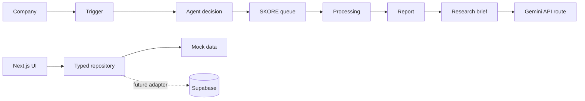

# WTFXAI Research Intelligence Dashboard

A production-shaped Agent Operations + SKORE Control Center for a fictional finance research team. The UI uses a typed Supabase repository and can be seeded with realistic data through the included migrations.

## Architecture

## Local setup

1. Install Node.js 18.17+.
2. Run `npm install`.
3. Copy `.env.example` to `.env.local`.
4. Run `npm run dev` and open `http://localhost:3000`.

The app works without credentials using mock data and a deterministic brief fallback. To enable Gemini, set `GEMINI_API_KEY`. Supabase variables are included for the planned adapter and migration.

## Routes

- `/` Command Center
- `/companies` searchable company universe
- `/companies/c1` company intelligence, SKORE history, triggers, and Research Brief
- `/queue` execution ledger
- `/activity` chronological agent feed
- `/watchlist` local watchlist interaction
- `/admin` manual queue/retry/rerun controls
- `/login` Supabase Auth scaffold

## Supabase

Run `supabase/migrations/001_initial_schema.sql` followed by `supabase/migrations/002_seed_mock_data.sql` in a Supabase SQL editor or through the Supabase CLI. The first migration creates all requested tables; the second upserts rows across sectors, including queued, failed, paused, and active states.

## Deployment

Create a Vercel project from this repository, set `NEXT_PUBLIC_SUPABASE_URL`, `NEXT_PUBLIC_SUPABASE_ANON_KEY`, and `GEMINI_API_KEY` in project environment variables, then deploy. No secrets are committed.

## Known limitations

Supabase Auth UI is still scaffolded and is not enabled. Queue actions provide pending feedback only; a worker and durable idempotency key should own execution in the backend. The watchlist remains browser-local because no watchlist table is part of the current schema.

## Command Center Metrics & Algorithmic Derivations

The Command Center KPI cards and panels are computed dynamically from the relational data model:
- **Sentiment Index**: Mean SKORE score computed across all scored jobs in the coverage ledger (`Σ score / N`).
- **Knowledge Depth**: Coverage ratio of companies with active trigger feeds, research jobs, or dossiers (`entitiesWithData / totalEntities * 100`).
- **Operational Confidence**: Quantitative execution reliability rate computed from `skore_jobs` (`completed / (completed + failed) * 100`).
- **Risk Profile**: Low-volatility/stability index calculated from trigger severity distribution (`(1 - (critical + high) / totalTriggers) * 100`).
- **Driver Weights Panel**: Reflects the actual per-company `factors` jsonb field in `skore_jobs`, displaying both algorithmic weight percentages and net impacts.
- **Reconfigure Factor Weights**: Interactive modal allowing desk operators to tune factor distributions with live validation (must total 100%) and real-time composite score recalibration.
- **Intelligence Correlation Chart**: Dynamically scales SVG spline paths from chronological historical `reports` and completed `skore_jobs` timestamps.

## Verification

- `npm run build`
- `npm test`
