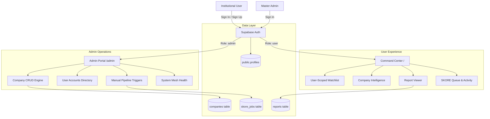

# WTFXAI Research Intelligence Dashboard

> **Institutional-grade Quantitative Research & Autonomous Agent Operations Platform**  
> Built with Next.js 14 (App Router), TypeScript, Supabase Auth & Relational Mesh, and Tailwind CSS.

---

## Overview

**WTFXAI Research Intelligence OS** is a high-performance financial intelligence workstation designed for quantitative research desks, portfolio managers, and risk officers. It synthesizes market signals, regulatory filings, and earnings revisions into algorithmic **SKORE** ratings, dynamic factor attributions, and neural research briefs.

The platform enforces a strict **Single-Admin vs Multi-User** role-based access architecture, with automated route redirection, individual user workspaces, and administrative company management (Full CRUD) and user directory controls.

---

## Core Capabilities & Modules

### 1. Command Center (`/`)
- **Realtime Sentiment & Health Metrics**: Dynamically calculated KPIs (Sentiment Index, Knowledge Depth, Operational Confidence, Risk Profile) derived from underlying jobs and triggers.
- **Personalized Desk Workspace**: User-scoped session banner displaying active clearance, desk department, and pinned coverage entities.
- **Interactive Spline Correlation Chart**: Chronological visualization scaling historical report scores and job executions.
- **Reconfigurable Factor Weights Modal**: Tune algorithmic sector drivers on the fly with live 100% weight validation and instant composite score recalculation.
- **Live Trigger Ledger**: Event-driven disclosure and market structure feed.

### 2. Role-Based Access & Security
- **Single-Admin Architecture**: Administrative privileges are strictly locked to a single predefined master ID (`admin@wtfxai.internal`, configurable via `NEXT_PUBLIC_ADMIN_EMAIL`).
- **Public Admin Registration Disabled**: All public signups are enforced as standard `user` accounts at both application and database trigger levels.
- **Automatic Route Redirection**:
  - Authenticating as **Admin** automatically opens the **Admin Portal** (`/admin`).
  - Authenticating as **User** automatically opens the **Command Center** (`/`).
- **Route & Component Guards (`AdminGuard`)**: Non-admin users are blocked from viewing or executing operator controls.

### 3. Admin Operations Portal (`/admin`)
- **Company Universe Management (Full CRUD)**:
  - **Create**: Add new equity coverage entities with ticker, full name, sector, and monitoring status.
  - **Read**: Live searchable catalog with operational badges and direct actions.
  - **Update**: In-place modification of company details and tracking status.
  - **Delete**: Remove companies from coverage with safety confirmation.
- **Application User Directory**:
  - Roster of all registered users with avatar initials, email, role badge (`ADMIN` or `USER`), department, and join date.
  - User access removal with protection for the master administrator.
- **System Health & Infrastructure**:
  - Live indicators for Postgres/Supabase connectivity, Asynchronous Worker Pool (4 workers), Neural Synthesis Model, and Security Boundary enforcement.
- **Pipeline Triggers & Session Audit**:
  - Manual triggers (Queue Workflow, Retry Error, Force Recalculate SKORE) with persistent session dispatch ledger.

### 4. User Authentication & Password Recovery (`/login`)
- **Streamlined 2-Tab Interface**: Clean switching between **Sign In** and **Sign Up**.
- **Password Recovery Flow**: Integrated Supabase `resetPasswordForEmail()` modal with instant feedback.
- **Verification Management**: One-click **Resend Verification Email** action when email confirmation is active in Supabase.

### 5. Company Intelligence & Research Universe (`/companies` & `/companies/[id]`)
- **Universe Explorer**: Search and filter by ticker, company name, or sector classification.
- **Company Dossier View**:
  - Historical SKORE progression and trigger timeline.
  - Interactive factor attribution matrix.
  - Neural-synthesized **Research Brief** powered by Gemini API with fallback synthesis.
  - One-click Watchlist toggle.

### 6. Research Reports & Report Viewer (`/reports` & `/reports/[id]`)
- **Certified Report Library**: Filterable repository of generated research reports with status badges (`Certified`, `In-Review`, `Draft`).
- **Dedicated Report Viewer (`/reports/[id]`)**: Full readable research dossier complete with executive summary, investment thesis, key catalysts, risk factor ledger, model checksums, and export options.

### 7. SKORE Queue & Agent Activity (`/queue` & `/activity`)
- **Asynchronous Execution Queue**: Track started, queued, completed, and failed tasks with backend retry and rerun actions.
- **Audit Feed**: Chronological ledger of trigger detections and autonomous agent decisions.

### 8. User-Isolated Desk Watchlist (`/watchlist`)
- **Scoped Portfolios**: Each user maintains an isolated list of pinned companies (`wtfxai_watchlist_${userId}`).
- Real-time synchronization of company tracking states and trigger alerts.

---

## Architecture Diagram



---

## Tech Stack

- **Framework**: Next.js 14.2 (App Router, Server & Client Components)
- **Language**: TypeScript 5.7
- **Styling**: Tailwind CSS + Custom High-Contrast Terminal Design Tokens (`globals.css`)
- **Authentication & Database**: Supabase JS SDK 2.45 (`auth`, PostgreSQL, Row-Level Security)
- **Icons**: Lucide React
- **Testing**: Vitest 2.1

---

## Getting Started

### 1. Prerequisites
- Node.js 18.17+ or 20+
- npm, yarn, or pnpm

### 2. Installation
```bash
git clone https://github.com/ilhamn3/Research-Intelligence-Dashboard.git
cd Research-Intelligence-Dashboard
npm install
```

### 3. Environment Variables
Copy `.env.example` to `.env.local`:
```bash
cp .env.example .env.local
```

Configure your credentials in `.env.local`:
```env
# Supabase Configuration
NEXT_PUBLIC_SUPABASE_URL=https://your-project.supabase.co
NEXT_PUBLIC_SUPABASE_ANON_KEY=your-supabase-anon-key

# Single Admin Account (Only this email receives admin clearance)
NEXT_PUBLIC_ADMIN_EMAIL=admin@wtfxai.internal

# Optional: Google Gemini API Key for neural synthesis
GEMINI_API_KEY=your-gemini-api-key

# Optional: FastAPI Backend URL
NEXT_PUBLIC_FASTAPI_URL=http://localhost:8000
```

> **Note**: The application includes mock fallbacks and local storage persistence, enabling full functionality even if external services are offline.

### 4. Database Setup (Supabase)
Execute the migration scripts in your **Supabase Dashboard** -> **SQL Editor** in sequence:
1. `supabase/migrations/001_initial_schema.sql` — Creates `companies`, `triggers`, `skore_jobs`, `reports`, `research_briefs`.
2. `supabase/migrations/002_seed_mock_data.sql` — Populates sample equities, triggers, and completed SKORE jobs.
3. `supabase/migrations/003_create_profiles.sql` — Creates the `profiles` table, RLS policies, and single-admin signup trigger.

### 5. Run Development Server
```bash
npm run dev
```
Open [http://localhost:3000](http://localhost:3000) (or the port specified by Next.js) in your browser.

---

## Verification & Quality Assurance

Run the test suite and production build verification:

```bash
# Run unit tests
npm test

# Build production bundle (type check + route prerender)
npm run build

# Run linter
npm run lint
```

---

## License

Private / Proprietary — WTFXAI Intelligence OS. All rights reserved.
